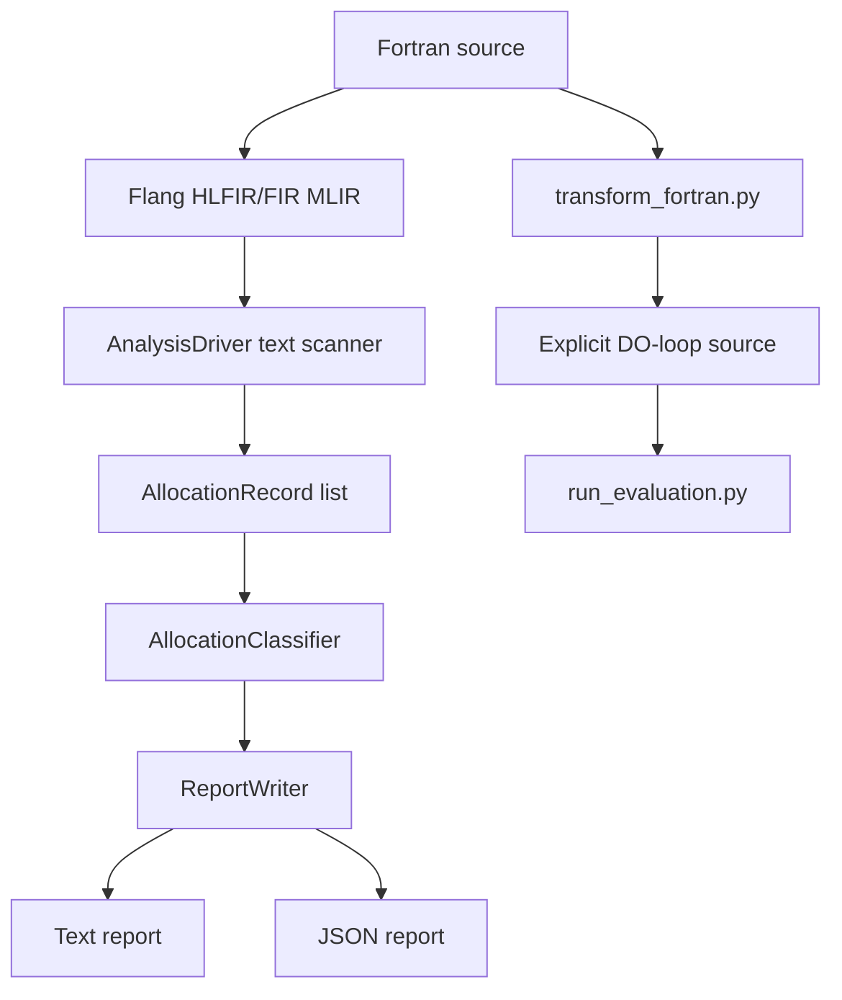

# Design Notes

## Objective

The project identifies implicit heap allocations in textual LLVM Flang HLFIR/FIR MLIR and explains why they may have been introduced. It is designed as a compiler-design lab prototype: the architecture mirrors a real MLIR pass pipeline, while the first implementation remains easy to build without requiring a full LLVM development installation.

## Pipeline

## C++ Components

- `AnalysisDriver`: reads an MLIR file, detects `fir.allocmem`, matches `fir.freemem`, captures `loc("file":line:column)`, stores the matched IR text, and estimates static sizes from visible `!fir.array<...>` types.
- `AllocationRecord`: data model for one detected allocation.
- `AllocationClassifier`: applies conservative rules to classify allocations as `PROVABLY_UNNECESSARY`, `POSSIBLY_UNNECESSARY`, or `NECESSARY`.
- `ReportWriter`: emits human-readable text reports and JSON reports.
- `main.cpp`: parses command-line options and connects analysis to reporting.

## Allocation Categories

### Array Expression Temporaries

Operations such as `hlfir.expr` and `hlfir.elemental` may represent lowered array expressions. If their lowering introduces `fir.allocmem`, the tool reports a likely temporary array allocation.

### Array-Valued Function Results

Function calls returning arrays may require result storage. The current prototype classifies unknown-size function-result storage as possibly unnecessary because avoidability depends on caller and callee lowering.

### Allocatable Assignment Reallocation

Assignments to allocatable arrays may trigger automatic reallocation when the current allocation state or shape does not match the right-hand side. These are classified as necessary unless stronger evidence is available.

### Copy-In/Copy-Out Temporaries

Passing non-contiguous array sections to procedures may force temporary buffers. The prototype treats copy-in/copy-out and overlap markers as necessary for correctness.

## Reporting

Reports include source file, line, column, IR operation, estimated bytes, estimated MB, classification, reason, confidence, and suggested transformation. Text output is intended for human reading; JSON output is intended for tools or later visualization.

## Transformation Prototype

`scripts/transform_fortran.py` is deliberately conservative. It transforms only simple one-dimensional assignments such as `A = B + C`, `A = B * C`, `A = B + scalar`, and `A(:) = B(:) + C(:)`. Complex expressions are preserved and reported as skipped.

## Evaluation

`scripts/run_evaluation.py` compiles original and transformed benchmarks, runs both versions, measures wall-clock time, and writes Markdown/JSON reports. Optional allocation tools are used when available.

