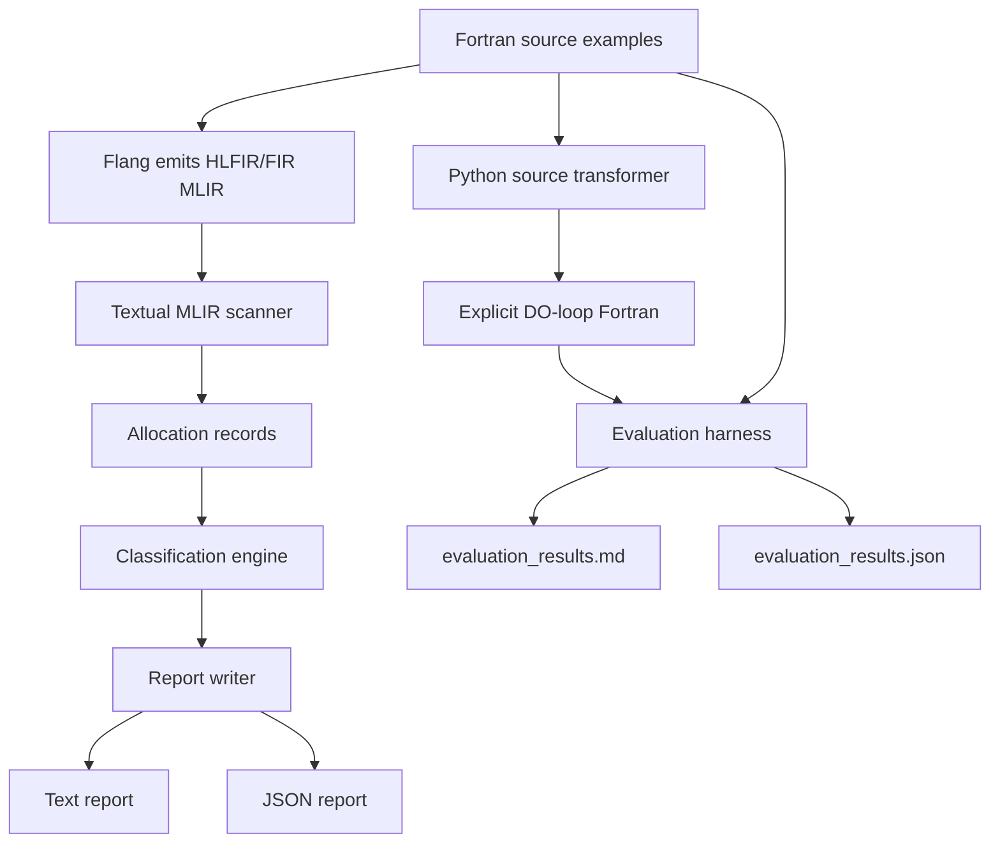
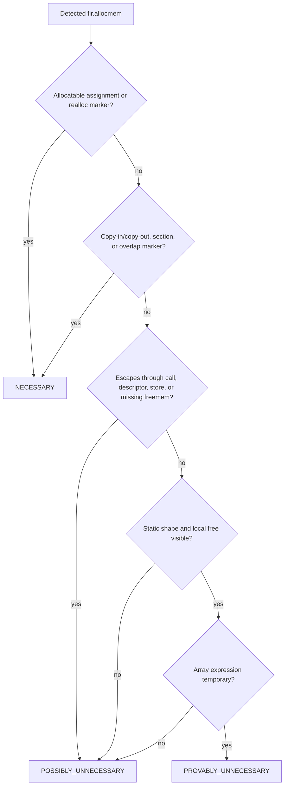
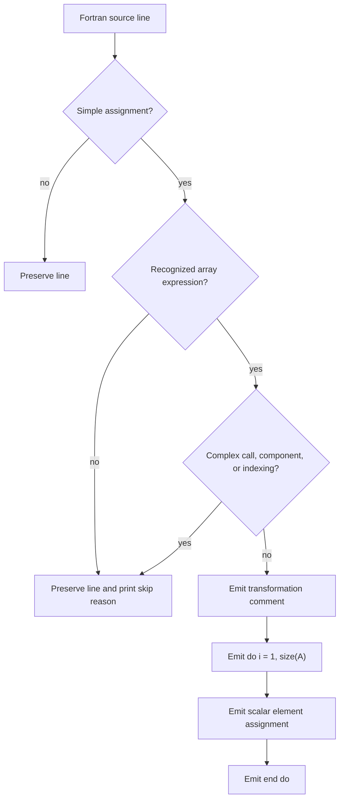

# Flang Implicit Allocation Profiler and Optimizer

## Abstract

Fortran array syntax allows programmers to write compact numerical code, but this convenience can hide temporary heap allocations introduced during compiler lowering. These allocations may appear in array expressions, array-valued function results, allocatable assignment, and copy-in/copy-out handling for non-contiguous array sections. This project implements a compiler-design lab prototype named **Flang Implicit Allocation Profiler and Optimizer**. The tool scans textual Flang HLFIR/FIR MLIR, detects `fir.allocmem` operations, matches `fir.freemem`, estimates static allocation sizes, classifies allocation necessity, reports source locations, and suggests transformations. A companion Python source-to-source transformer demonstrates how simple Fortran array assignments can be rewritten as explicit `DO` loops. A benchmark harness compiles and runs original and transformed programs and emits Markdown and JSON evaluation reports.

## Problem Statement

The goal of this lab is to detect and explain implicit heap allocations that are not obvious in Fortran source code. For example, a statement such as:

```fortran
A = B + C
```

may be lowered through an intermediate array temporary before assignment. Such temporaries can increase memory traffic, reduce locality, and create unpredictable runtime costs. The project targets four allocation sources:

- array expression temporaries
- array-valued function results
- automatic reallocation on allocatable assignment
- copy-in/copy-out or array section temporaries

The assignment also requires reporting, classification, transformation suggestions, and a small performance evaluation framework.

## Background: Hidden Allocations in Fortran

Fortran has high-level array semantics. Whole-array expressions, array sections, and allocatable arrays allow concise mathematical notation, but the compiler must preserve language correctness. In some cases, preserving semantics requires temporary storage.

Array expression temporaries can occur when the compiler evaluates an expression such as `A = (B + C) * D`. Array-valued functions can require result buffers. Allocatable assignment may reallocate the left-hand side if the shape changes. Non-contiguous array sections passed to procedures can require copy-in/copy-out buffers so the callee observes a contiguous argument while the caller receives updated values afterward.

These allocations are valid compiler behavior, but they are often invisible to the programmer. A profiling tool that maps lowered IR allocation operations back to source locations can help explain performance surprises.

## Why Flang HLFIR/FIR Helps

LLVM Flang lowers Fortran through MLIR dialects that preserve useful semantic information. HLFIR is higher-level and keeps Fortran expression and assignment concepts visible. FIR represents lower-level Fortran memory, descriptors, calls, and array operations.

This project uses HLFIR/FIR terminology because hidden allocations become visible through operations such as:

- `fir.allocmem`
- `fir.freemem`
- `hlfir.expr`
- `hlfir.assign`
- `hlfir.elemental`
- `fir.call`
- `fir.slice`

`fir.allocmem` is the central detection point because it represents heap allocation in FIR. Nearby HLFIR/FIR operations provide context for classifying why the allocation was introduced.

## Design Architecture

The project is organized as a small compiler-analysis pipeline. The C++ tool reads an MLIR text file, scans for FIR allocation operations, records source locations, classifies allocations, and emits reports. Separate Python scripts support Fortran source transformation and performance evaluation.



Main implementation components:

- `AnalysisDriver`: reads MLIR text and detects allocation/free operations
- `AllocationRecord`: stores operation name, value, source location, size, and local-use facts
- `AllocationClassifier`: assigns necessity classification, confidence, and suggestion
- `ReportWriter`: emits text and JSON reports
- `transform_fortran.py`: rewrites simple array assignments into explicit loops
- `run_evaluation.py`: compiles and times original/transformed benchmarks

## Implementation Details

The first working version uses a textual MLIR scanner instead of linking against the full MLIR parser. This keeps the project beginner-friendly and buildable on a normal lab machine. The CMake project still uses LLVM/MLIR/Flang terminology and includes an optional `FAP_ENABLE_LLVM` flag for future integration.

The scanner reads the input line by line and detects allocation patterns such as:

```mlir
%tmp = fir.allocmem !fir.array<1024x1024xf64> loc("file.f90":12:7)
```

It extracts:

- SSA value name, for example `%tmp`
- operation name, currently `fir.allocmem`
- source location from `loc("file":line:column)`
- static array shape and element type when visible
- matching `fir.freemem` for the same SSA value
- simple local-use facts such as call use, descriptor escape, or copy-in/copy-out markers

Static size estimation is based on FIR array type spelling. For example:

```mlir
!fir.array<1024x1024xf64>
```

is estimated as `1024 * 1024 * 8 = 8388608` bytes, or `8.00 MB`.

## Detected IR Operations

The implemented detector focuses on `fir.allocmem` and `fir.freemem`. The classifier then uses nearby text to infer higher-level causes.

| Operation or Marker | Role in Tool |
| --- | --- |
| `fir.allocmem` | Primary implicit heap allocation detection point |
| `fir.freemem` | Matching free operation used to estimate local lifetime |
| `hlfir.expr` | Evidence for array expression temporary |
| `hlfir.elemental` | Evidence for element-wise array expression lowering |
| `hlfir.assign` | Evidence for assignment or allocatable reassignment |
| `fir.call` | Possible escape or function-result context |
| `fir.slice` | Evidence for array section or copy-in/copy-out behavior |
| `loc("file":line:column)` | Source mapping metadata |

## Classification Rules

Each allocation is classified into one of three categories.



Rules used by the prototype:

| Classification | Rule Summary | Example Suggestion |
| --- | --- | --- |
| `PROVABLY_UNNECESSARY` | Static-size array expression temporary, only local uses, no escape, freed locally | Replace whole-array expression with explicit loop or stack-sized local buffer |
| `POSSIBLY_UNNECESSARY` | Runtime shape unknown, array-valued result, possible escape, or insufficient context | Inspect uses, preallocate storage, or use explicit output argument |
| `NECESSARY` | Allocatable reallocation, shape mismatch, copy-in/copy-out, non-contiguous section, or overlap correctness | Preallocate when possible, pass contiguous data, avoid strided sections |

The confidence score is heuristic. It is not a formal proof; it communicates how much evidence the textual scanner found.

## Source Reporting

Reports are generated in both human-readable text and JSON. Each allocation entry includes:

- source file
- source line
- source column
- IR operation name
- estimated bytes
- estimated MB
- classification
- reason
- suggested transformation

Example text report entry:

```text
line 12: array expression temporary generates 8.00 MB temporary array allocation
classification: PROVABLY_UNNECESSARY
suggestion: replace the whole-array expression with an explicit loop or stack-sized local buffer
```

The CLI supports:

```text
--format=text
--format=json
--show-ir
--threshold-mb=1
```

`--threshold-mb` filters small statically-sized allocations while keeping unknown-size allocations visible.

## Transformation Strategy

The Python transformer is a source-to-source prototype, not a full compiler transformation. It intentionally handles only simple one-dimensional array assignments:

- `A = B + C`
- `A = B * C`
- `A = B + scalar`
- `A(:) = B(:) + C(:)`

It rewrites them into explicit loops:

```fortran
! transformed by transform_fortran.py: explicit loop avoids an array temporary
do i = 1, size(A)
  A(i) = B(i) + C(i)
end do
```

The transformer preserves indentation, adds comments, and prints skipped lines with reasons. It avoids complex cases such as function calls, derived-type components, unclear indexing, or scalar control-variable assignments.



## Evaluation Methodology

The evaluation framework is implemented in `scripts/run_evaluation.py`. It:

1. detects a Fortran compiler such as `gfortran`, `flang-new`, or `flang`
2. transforms benchmark source files when possible
3. compiles original and transformed versions
4. runs each executable multiple times
5. records mean execution time
6. tries optional allocation tools if available
7. writes `report/evaluation_results.md` and `report/evaluation_results.json`

Optional allocation tools include `/usr/bin/time`, Valgrind Massif, and an `LD_PRELOAD` malloc counter implemented in `scripts/malloc_counter.c`. On the Windows evaluation machine, these tools were unavailable, so the report records placeholder availability messages.

Benchmarks used:

- `benchmark_array_temp.f90`
- `benchmark_allocatable_realloc.f90`
- `benchmark_function_result.f90`

## Results

The generated evaluation used `gfortran`, ran each executable three times, and executed on `Windows-11-10.0.26200-SP0`.

| Benchmark | Original Compile | Original Run | Original Mean Seconds | Transformed Compile | Transformed Run | Transformed Mean Seconds | Notes |
| --- | --- | --- | ---: | --- | --- | ---: | --- |
| `benchmark_array_temp` | ok | ok | 0.058115 | ok | ok | 0.070791 | Simple array expression transformed |
| `benchmark_allocatable_realloc` | ok | ok | 0.056035 | ok | ok | 0.056578 | Scalar/control assignments skipped |
| `benchmark_function_result` | ok | ok | 0.080379 | ok | ok | 0.046625 | Function-result benchmark compiled and ran |

Allocation counting tools were unavailable on this Windows run:

| Tool | Availability |
| --- | --- |
| `/usr/bin/time` | unavailable |
| Valgrind Massif | unavailable |
| `LD_PRELOAD` malloc counter | unavailable on Windows |

The results demonstrate that the framework works end-to-end. Timing differences should not be interpreted as final performance claims because the benchmark sizes are small, run counts are low, and Windows process startup overhead is visible. The more important result for this lab stage is that original and transformed programs compile, run, and produce structured timing reports.

## Limitations

This project is a prototype and has several limitations:

- The C++ analyzer scans MLIR text instead of using MLIR parser APIs.
- Classification is heuristic and based on nearby text, not full def-use chains.
- Static size estimation only supports simple visible `!fir.array<...>` shapes.
- The transformer is not a complete Fortran parser.
- The transformer only handles simple one-dimensional array assignments.
- Benchmark results are sensitive to platform, compiler, optimization level, and process startup.
- Allocation counting was not available on the Windows test environment.
- Generated transformed benchmark files live under `build/evaluation` and are not intended as source-of-truth examples.

## Future Work

Future improvements could make the tool more compiler-like:

- integrate directly with MLIR parser and operation-walking APIs
- implement real SSA def-use analysis
- detect allocation lifetimes across blocks and functions
- classify descriptor escape more accurately
- support more FIR/HLFIR operations and source-location forms
- add CSV output for spreadsheet analysis
- integrate profiler output with transformation suggestions
- implement a proper Fortran AST-based source transformer
- support multidimensional arrays and bounds-aware loop generation
- run allocation counters on Linux using Valgrind or `LD_PRELOAD`
- compare Flang and gfortran behavior across optimization levels

## Conclusion

The Flang Implicit Allocation Profiler and Optimizer demonstrates how compiler IR can expose performance costs hidden by high-level Fortran syntax. By scanning HLFIR/FIR-like MLIR, the tool detects `fir.allocmem`, matches `fir.freemem`, estimates allocation size, maps reports to source locations, classifies allocation necessity, and suggests transformations. The Python transformer and evaluation framework complete the lab by showing how detected array temporaries can be connected to practical source rewrites and benchmark measurements. While the current implementation is intentionally lightweight, its architecture follows the structure of a real compiler analysis pipeline and provides a clear path toward full MLIR/Flang integration.

